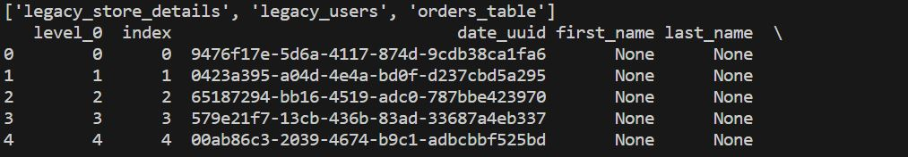
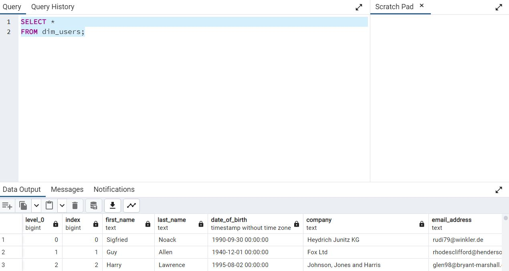
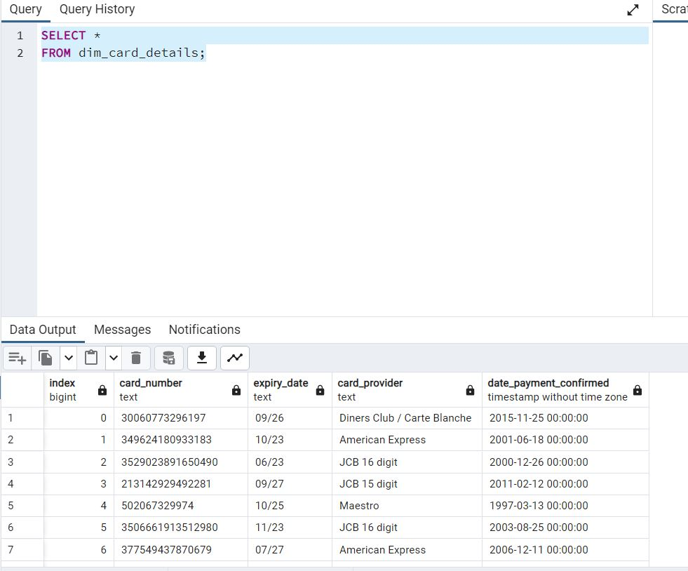
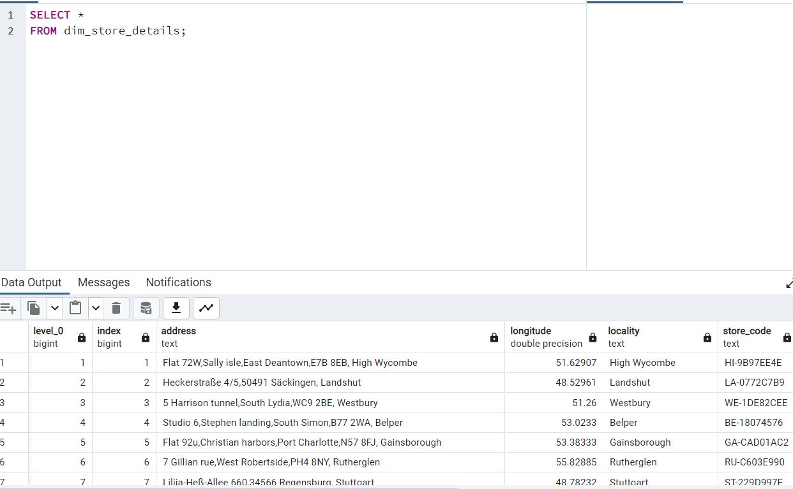
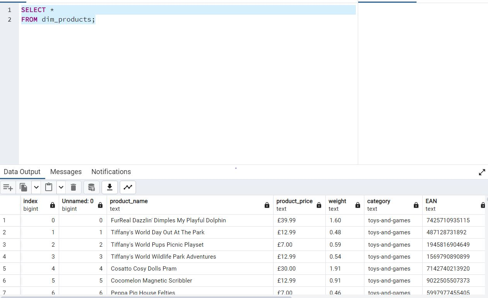
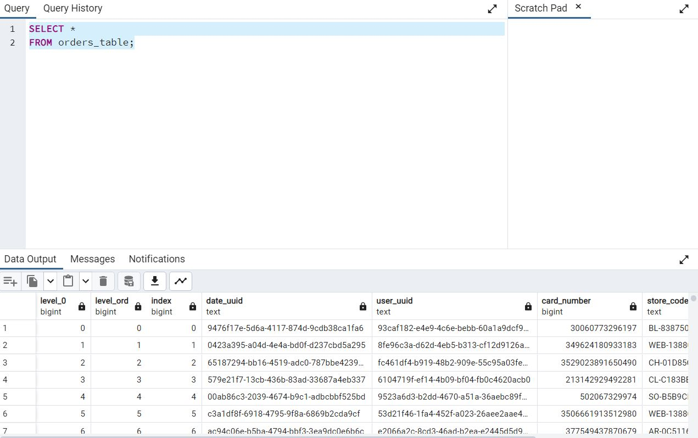

# multinational-retail-data-centralisation
# **Multinational Retail Data Centralisation project**
This project is to produce a system that stores the data for a multinational company that sells various goods across the globe in a database so that it's accessed from one centralised location and acts as a single source of truth for sales data.
## **Milestone2** 
- **Task1:** 
    - Initialise and setup a new database within pgAdmin4 and name it *sales_data*.
- **Task2:**
    - Initialise the three project classes,In this task we define the scripts and classes we would use to extract and clean the data from multiple data sources.
        - Step1: 
            - Create a new Python script named *data_extraction.py* and within it, create a class named *DataExtractor*.
            - This class will work as a utility class, in we create methods that help extract data from different data sources.
            - The methods contained will be fit to extract data from a particular data source, these sources will include CSV files, an API and an S3 bucket. 
        - Step2:
            -  Create another script named *database_utils.py* and within it, create a class *DatabaseConnector* which we will use to connect with and upload data to the database.   
        - Step3:
            - Create a script named *data_cleaning.py* this script contains a class *DataCleaning* with methods to clean data from each of the data sources.   
- **Task3:**
    - The historical data of users is currently stored in an AWS database in the cloud. We create methods in *DataExtractor* and *DatabaseConnector* class which help extract the information from an AWS RDS database.
        - Step1:
            - We create the *db_creds.yaml* file which contains the DB credentials and add it to the .gitignore file so that the credentials are not upoaded to public. 
        - Step2:
            - We create the method *read_db_creds* - which reads the credentials from the yaml file above and returns a dictionary of the credentials.
            - For this the python libraries required to be downloaded are: PyYAML , and then *import yaml* in the script.
        - Step3:
            - We create the method *init_db_engine* which reads the creds from above *read_db_creds* and return an *sqlalchemy* db engine. (*sqlalchemy* needs to be installed using pip install)  
        - Step4:
            - Using the engine from *init_db_engine* we create a method *list_db_tables* to list all the tables in the DB
        - Step5:
            - In this step, we create a method *read_rds_table* to extract the db table to a pandas df.  It takes in an instance of *DatabaseConnector* class and the table name as an argument and return a pandas DataFrame.
            Using *list_db_tables* method to get the name of the table containing user data.  
        - Step6:
            - To clean the df, we create a method *clean_user_data* in the *DataCleaning* class.
        - Step7:
            - Now we create a method *upload_to_db* in *DatabaseConnector* class to store data in *sales_data* DB in a table named *dim_users*.
            
            
- **Task4:**
    - Extract the users and card details
        - Step1:
            - The users card details are stored in a PDF document in an AWS S3 bucket so we install python package *tabula-py* to extract data from pdf document.
        - Step2:
            - We create a method in *DataExtractor* class as *retrieve_pdf_data* which returns a pandas DF.
        - Step3:
            - We create a cleaning method *clean_card_data* in *DataCleaning* class to clean the data.
        - Step4:
            - Now we upload the table using method *upload_to_db* in *DatabaseConnector* class to store data in *sales_data* DB in a table named *dim_card_details*.
            
- **Task5:**
    - Data is retrieved using API GET methods.
        - Step1:
            - We create a method in *DataExtractor* class as *list_number_of_stores* which returns the number of stores.
        - Step2 and Step3:
            - We craete another method *retrieve_stores_data* whic takes the number of stores and extracts all the data from API returning a pandas DF.
        - Step4:
            - To clean we create a method *clean_Store_data* in *DataCleaning*.
        - Step5:
            - Now we upload the DF using *upload_to_db* method storing the table as *dim_store_details*
            
- **Task6:**
    - Data is retrieved from S3 bucket on AWS having CSV format
        - Step1:
            - We create a method *extract_from_s3* in *DataExtractor* class  which uses *boto-3* package (needs to be installed first using pip)
            - Using the above method and S3 address, return the Pandas DF(AWS CLI must be logged in before we retrieve data from S3 bucket).
        - Step2:
            - To clean data we create a method called *convert_product_weights* in *DataCleaning* class whcih takes Pandas DF and return the weight in kg having decimal value.
        - Step3 and Step4:
            - We clean the additional values with method *clean_products_data* and then upload the data into db using *upload_to_db* method in the table named *dim_products*.
            
- **Task7:**
    - To retrieve the orders table from task 1 which is stored in db on AWS RDS.
        - Step1:
            - List all the tables using earlier method: *list_db_tables* to get all the names of the table.
        - Step2:
            - Extract the details using *read_rds_tables* and return the Pandas DF.
        - Step3:
            - Create a method to clean the DB with *clean_orders_data* method 
        - Step4:
            - After cleaning, we upload the table using *upload_to_db* method and table name as *orders_table*.
                

 

