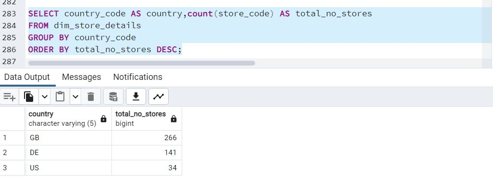
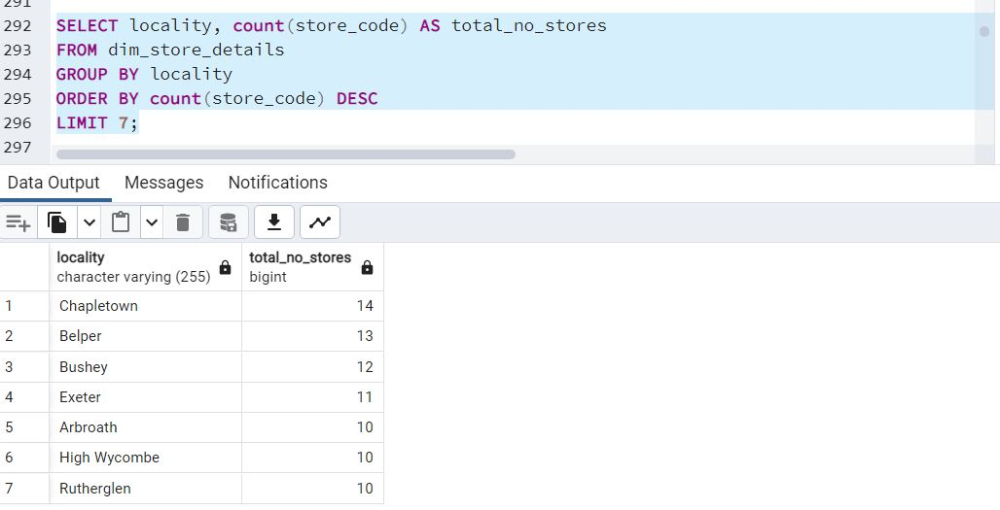
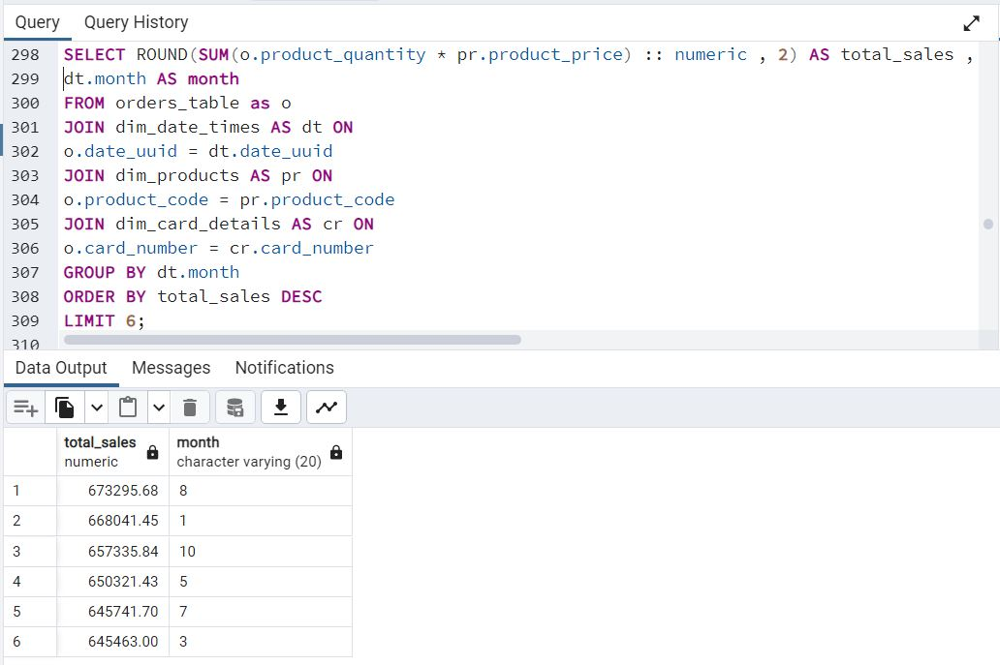
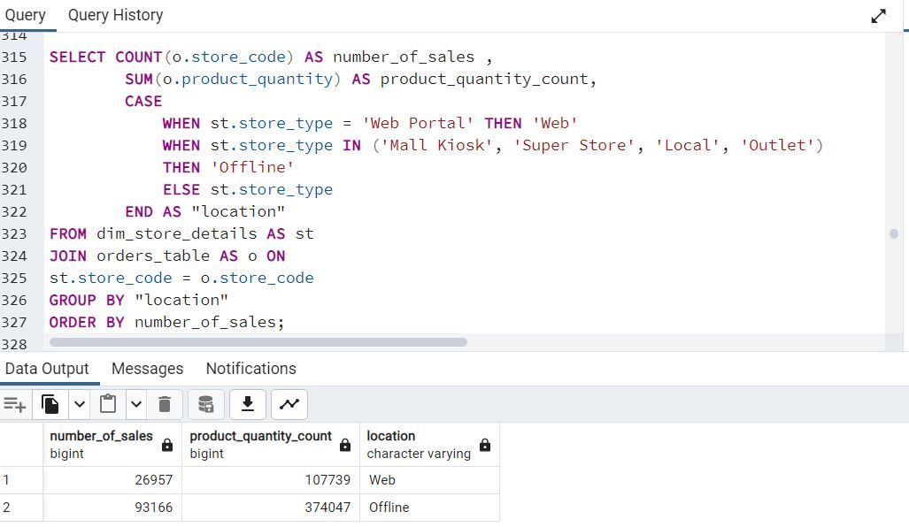
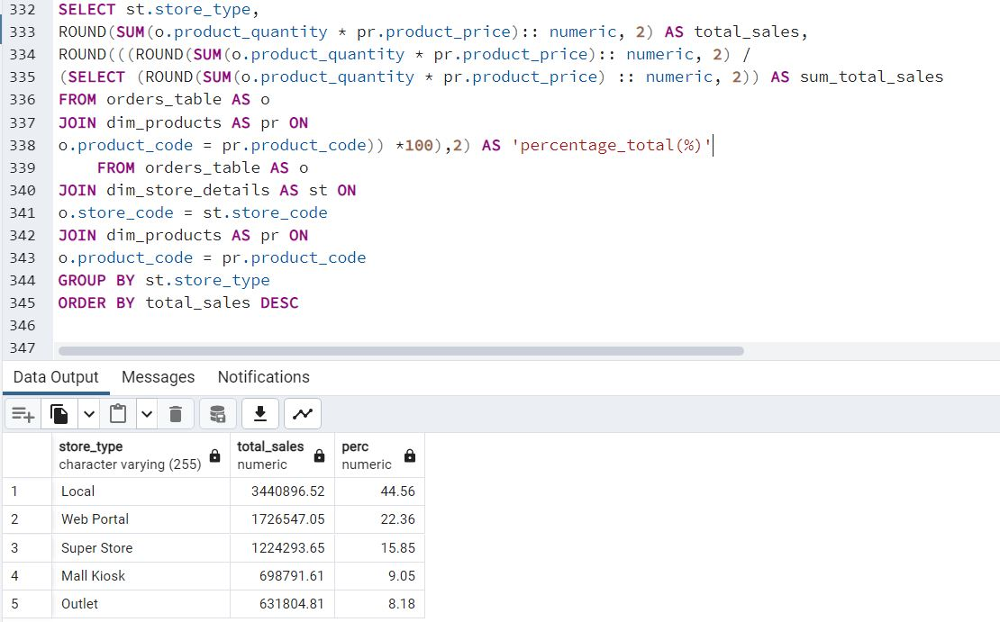
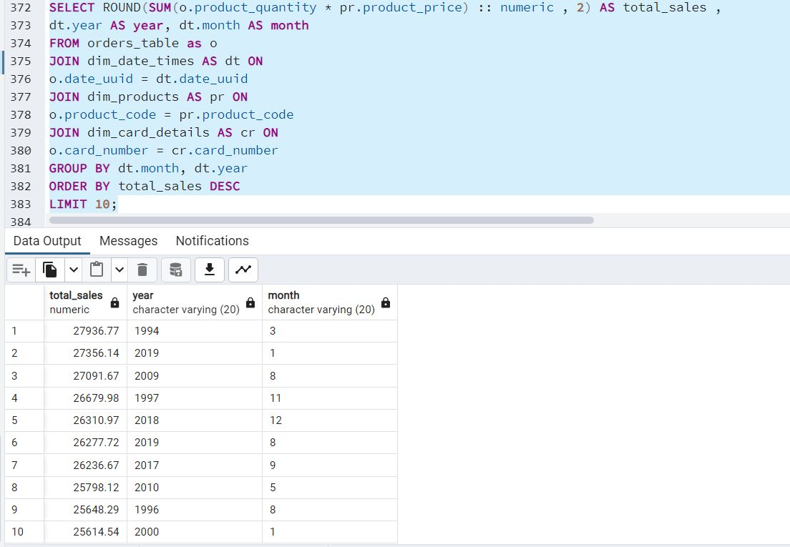
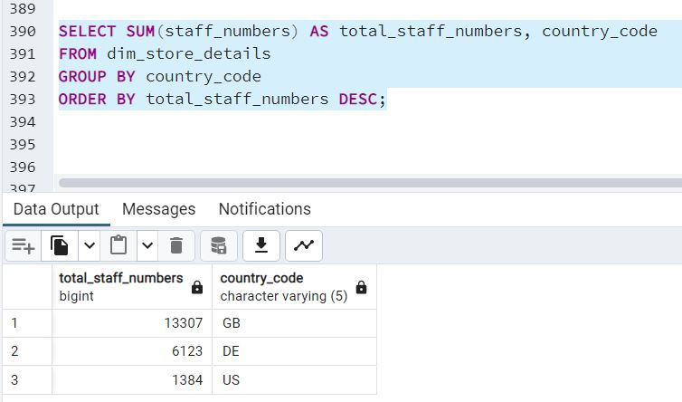
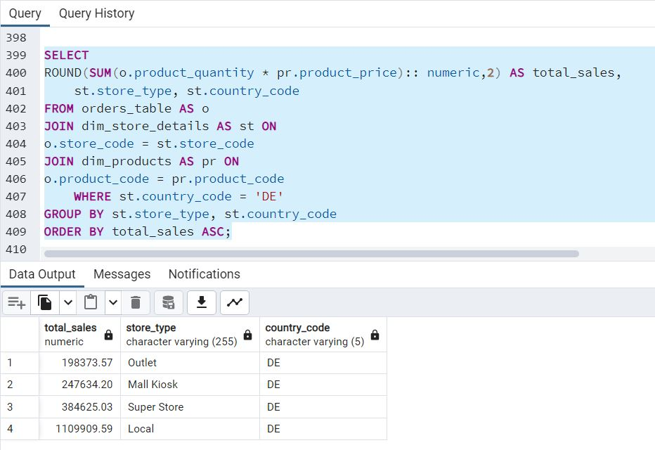

# multinational-retail-data-centralisation
# **Multinational Retail Data Centralisation project**
This project is to produce a system that stores the data for a multinational company that sells various goods across the globe in a database so that it's accessed from one centralised location and acts as a single source of truth for sales data.
## **Milestone2** 
- **Task1:** 
    - Initialise and setup a new database within pgAdmin4 and name it *sales_data*.
- **Task2:**
    - Initialise the three project classes,In this task we define the scripts and classes we would use to extract and clean the data from multiple data sources.
        - Step1: 
            - Create a new Python script named *data_extraction.py* and within it, create a class named *DataExtractor*.
            - This class will work as a utility class, in we create methods that help extract data from different data sources.
            - The methods contained will be fit to extract data from a particular data source, these sources will include CSV files, an API and an S3 bucket. 
        - Step2:
            -  Create another script named *database_utils.py* and within it, create a class *DatabaseConnector* which we will use to connect with and upload data to the database.   
        - Step3:
            - Create a script named *data_cleaning.py* this script contains a class *DataCleaning* with methods to clean data from each of the data sources.   
- **Task3:**
    - The historical data of users is currently stored in an AWS database in the cloud. We create methods in *DataExtractor* and *DatabaseConnector* class which help extract the information from an AWS RDS database.
        - Step1:
            - We create the *db_creds.yaml* file which contains the DB credentials and add it to the .gitignore file so that the credentials are not upoaded to public. 
        - Step2:
            - We create the method *read_db_creds* - which reads the credentials from the yaml file above and returns a dictionary of the credentials.
            - For this the python libraries required to be downloaded are: PyYAML , and then *import yaml* in the script.
        - Step3:
            - We create the method *init_db_engine* which reads the creds from above *read_db_creds* and return an *sqlalchemy* db engine. (*sqlalchemy* needs to be installed using pip install)  
        - Step4:
            - Using the engine from *init_db_engine* we create a method *list_db_tables* to list all the tables in the DB
        - Step5:
            - In this step, we create a method *read_rds_table* to extract the db table to a pandas df.  It takes in an instance of *DatabaseConnector* class and the table name as an argument and return a pandas DataFrame.
            Using *list_db_tables* method to get the name of the table containing user data.  
        - Step6:
            - To clean the df, we create a method *clean_user_data* in the *DataCleaning* class.
        - Step7:
            - Now we create a method *upload_to_db* in *DatabaseConnector* class to store data in *sales_data* DB in a table named *dim_users*.
            
            
- **Task4:**
    - Extract the users and card details
        - Step1:
            - The users card details are stored in a PDF document in an AWS S3 bucket so we install python package *tabula-py* to extract data from pdf document.
        - Step2:
            - We create a method in *DataExtractor* class as *retrieve_pdf_data* which returns a pandas DF.
        - Step3:
            - We create a cleaning method *clean_card_data* in *DataCleaning* class to clean the data.
        - Step4:
            - Now we upload the table using method *upload_to_db* in *DatabaseConnector* class to store data in *sales_data* DB in a table named *dim_card_details*.
            
- **Task5:**
    - Data is retrieved using API GET methods.
        - Step1:
            - We create a method in *DataExtractor* class as *list_number_of_stores* which returns the number of stores.
        - Step2 and Step3:
            - We craete another method *retrieve_stores_data* whic takes the number of stores and extracts all the data from API returning a pandas DF.
        - Step4:
            - To clean we create a method *clean_Store_data* in *DataCleaning*.
        - Step5:
            - Now we upload the DF using *upload_to_db* method storing the table as *dim_store_details*
            
- **Task6:**
    - Data is retrieved from S3 bucket on AWS having CSV format
        - Step1:
            - We create a method *extract_from_s3* in *DataExtractor* class  which uses *boto-3* package (needs to be installed first using pip)
            - Using the above method and S3 address, return the Pandas DF(AWS CLI must be logged in before we retrieve data from S3 bucket).
        - Step2:
            - To clean data we create a method called *convert_product_weights* in *DataCleaning* class whcih takes Pandas DF and return the weight in kg having decimal value.
        - Step3 and Step4:
            - We clean the additional values with method *clean_products_data* and then upload the data into db using *upload_to_db* method in the table named *dim_products*.
            
- **Task7:**
    - To retrieve the orders table from task 1 which is stored in db on AWS RDS.
        - Step1:
            - List all the tables using earlier method: *list_db_tables* to get all the names of the table.
        - Step2:
            - Extract the details using *read_rds_tables* and return the Pandas DF.
        - Step3:
            - Create a method to clean the DB with *clean_orders_data* method 
        - Step4:
            - After cleaning, we upload the table using *upload_to_db* method and table name as *orders_table*.
                
## **Milestone3** 
- **Task1:** 
    -   To cast the columns of *orders_table* with correct datatypes.
        +------------------+--------------------+--------------------+
        |   orders_table   | current data type  | required data type |
        +------------------+--------------------+--------------------+
        | date_uuid        | TEXT               | UUID               |
        | user_uuid        | TEXT               | UUID               |
        | card_number      | TEXT               | VARCHAR(30)        |
        | store_code       | TEXT               | VARCHAR(15)        |
        | product_code     | TEXT               | VARCHAR(15)        |
        | product_quantity | BIGINT             | SMALLINT           |
        +------------------+--------------------+--------------------+
- **Task3:**
    -   To cast the columns of *dim_user_table* with correct datatypes.
        +----------------+--------------------+--------------------+
        | dim_user_table | current data type  | required data type |
        +----------------+--------------------+--------------------+
        | first_name     | TEXT               | VARCHAR(255)       |
        | last_name      | TEXT               | VARCHAR(255)       |
        | date_of_birth  | TEXT               | DATE               |
        | country_code   | TEXT               | VARCHAR(5)         |
        | user_uuid      | TEXT               | UUID               |
        | join_date      | TEXT               | DATE               |
        +----------------+--------------------+--------------------+
- **Task4:**
    -   There are two latitude columns in the store details table i.e. *dim_store_details*. Using SQL, merge one of the      columns into the other so we have one latitude column.

    -    Then set the data types for each column as shown below:

        +---------------------+-------------------+------------------------+
        | store_details_table | current data type |   required data type   |
        +---------------------+-------------------+------------------------+
        | longitude           | TEXT              | FLOAT                  |
        | locality            | TEXT              | VARCHAR(255)           |
        | store_code          | TEXT              | VARCHAR(15)            |
        | staff_numbers       | TEXT              | SMALLINT               |
        | opening_date        | TEXT              | DATE                   |
        | store_type          | TEXT              | VARCHAR(255) NULLABLE  |
        | latitude            | TEXT              | FLOAT                  |
        | country_code        | TEXT              | VARCHAR(5)             |
        | continent           | TEXT              | VARCHAR(255)           |
        +---------------------+-------------------+------------------------+
        There is a row that represents the business's website change the location column values where they're null to N/A.  
-   **Task4:**
    -   We need some work on the *dim_products* table before casting the data types correctly.

    -   The product_price column has a £ character which you need to remove using SQL.

    -   The team that handles the deliveries would like a new human-readable column added for the weight so they can quickly make decisions on delivery weights.

    -   Add a new column weight_class which will contain human-readable values based on the weight range of the product. Using *case and when* we implement the change. 

        +--------------------------+-------------------+
        | weight_class VARCHAR(?)  | weight range(kg)  |
        +--------------------------+-------------------+
        | Light                    | < 2               |
        | Mid_Sized                | >= 2 - < 40       |
        | Heavy                    | >= 40 - < 140     |
        | Truck_Required           | => 140            |
        +----------------------------+-----------------+
- **Task5:**
    -   After all the columns are created and cleaned, change the data types of the products table.

    -   You rename the removed column to still_available before changing its data type.

    -   Make the changes to the columns to cast them to the following data types:

        +-----------------+--------------------+--------------------+
        |  dim_products   | current data type  | required data type |
        +-----------------+--------------------+--------------------+
        | product_price   | TEXT               | FLOAT              |
        | weight          | TEXT               | FLOAT              |
        | EAN             | TEXT               | VARCHAR(20)        |
        | product_code    | TEXT               | VARCHAR(15)        |
        | date_added      | TEXT               | DATE               |
        | uuid            | TEXT               | UUID               |
        | still_available | TEXT               | BOOL               |
        | weight_class    | TEXT               | VARCHAR(20)        |
        +-----------------+--------------------+--------------------+
-   **Task6:**
    -   Now update the date table with the correct types:

        +-----------------+-------------------+--------------------+
        | dim_date_times  | current data type | required data type |
        +-----------------+-------------------+--------------------+
        | month           | TEXT              | VARCHAR(20)        |
        | year            | TEXT              | VARCHAR(20)        |
        | day             | TEXT              | VARCHAR(20)        |
        | time_period     | TEXT              | VARCHAR(20)        |
        | date_uuid       | TEXT              | UUID               |
        +-----------------+-------------------+--------------------+
-   **Task7:**
    -   Now we need to update the last table for the card details.

    -   Make the associated changes after finding out what the lengths of each variable should be:

        +------------------------+-------------------+--------------------+
        |    dim_card_details    | current data type | required data type |
        +------------------------+-------------------+--------------------+
        | card_number            | TEXT              | VARCHAR(30)        |
        | expiry_date            | TEXT              | VARCHAR(10)        |
        | date_payment_confirmed | TEXT              | DATE               |
        +------------------------+-------------------+--------------------+
-   **Task8:**
    -   To create the primary Keys in the dimensions(dim) tables.

    -   Now that the tables have the appropriate data types we can begin adding the primary keys to each of the tables prefixed with dim.

    -   Each table will serve the orders_table which will be the single source of truth for our orders.

    -   Check the column header of the orders_table you will see all but one of the columns exist in one of our tables prefixed with dim.

    -   We need to update the columns in the dim tables with a primary key that matches the same column in the orders_table.

    -   Using SQL, update the respective columns as primary key columns. 
**Task9:**
    -   Final step for the star-based-schema and to add the foreign keys to the *orders_table*.

    -   With the primary keys created in the tables prefixed with dim we can now create the foreign keys in the orders_table to reference the primary keys in the other tables.

    -   Use SQL to create those foreign key constraints that reference the primary keys of the other table.

    -   This makes the star-based database schema complete.
## **Milestone4**: To Query the data uploaded into Sales Database 
- **Task1:** 
    -   To query and get results to know which countries they currently operate in and which        country now has the most stores. The query as below:
        ```sql
        *SELECT country_code AS country,count(store_code) AS total_no_stores*
        *FROM dim_store_details*
        *GROUP BY country_code*
        *ORDER BY total_no_stores DESC;*
        ```
    Results are as below:
    
- **Task2:**
    -   To get the localities which has the most stores.
        Query as below:
        ```sql
        *SELECT locality, count(store_code) AS total_no_stores*
        *FROM dim_store_details*
        *GROUP BY locality*
        *ORDER BY count(store_code) DESC*
        *LIMIT 7;*
        ```
    Results are as below:
    
- **Task3:**
    -   To Query the database to find out which months typically have the most sales.
        Query as below:
        ```sql
        SELECT ROUND(SUM(o.product_quantity * pr.product_price) :: numeric , 2) AS total_sales ,
        dt.month AS month
        FROM orders_table as o
        JOIN dim_date_times AS dt ON
        o.date_uuid = dt.date_uuid
        JOIN dim_products AS pr ON
        o.product_code = pr.product_code
        JOIN dim_card_details AS cr ON
        o.card_number = cr.card_number
        GROUP BY dt.month
        ORDER BY total_sales DESC
        LIMIT 6;
        ```
        Results are as below:
        
- **Task4:**
    -   To know how many sales are happening online vs offline.
        Calculate how many products were sold and the amount of sales made for online and offline purchases.
        Query as below:
        ```sql
        SELECT COUNT(o.store_code) AS number_of_sales , 
		SUM(o.product_quantity) AS product_quantity_count,
		CASE
			WHEN st.store_type = 'Web Portal' THEN 'Web'
			WHEN st.store_type IN ('Mall Kiosk', 'Super Store', 'Local', 'Outlet') 
			THEN 'Offline'
			ELSE st.store_type
		END AS "location"
        FROM dim_store_details AS st
        JOIN orders_table AS o ON
        st.store_code = o.store_code
        GROUP BY "location"
        ORDER BY number_of_sales;
        ```
        Results are as below:
        
-   **Task5:**
    -   To know which of the different store types is generated the most revenue so they know where to  focus.Find out the total and percentage of sales coming from each of the different store types.
        Query as below:
        ```sql
        SELECT st.store_type, 
        ROUND(SUM(o.product_quantity * pr.product_price):: numeric, 2) AS total_sales,
        ROUND(((ROUND(SUM(o.product_quantity * pr.product_price):: numeric, 2) / 
        (SELECT	(ROUND(SUM(o.product_quantity * pr.product_price) :: numeric, 2)) AS sum_total_sales
        FROM orders_table AS o
        JOIN dim_products AS pr ON
        o.product_code = pr.product_code)) *100),2) AS 'percentage_total(%)'
            FROM orders_table AS o
        JOIN dim_store_details AS st ON 
        o.store_code = st.store_code
        JOIN dim_products AS pr ON
        o.product_code = pr.product_code
        GROUP BY st.store_type
        ORDER BY total_sales DESC

        --OR

        WITH T AS (
        SELECT st.store_type, 
        SUM(o.product_quantity * pr.product_price):: numeric AS total_sales
        FROM orders_table AS o
        JOIN dim_store_details AS st ON 
        o.store_code = st.store_code
        JOIN dim_products AS pr ON
        o.product_code = pr.product_code
        GROUP BY st.store_type
        ORDER BY total_sales DESC )
        SELECT T.store_type,
        ROUND(T.total_sales,2),
        ROUND(((T.total_sales/(SELECT SUM(T1.total_sales) FROM T T1)) * 100),2) 
        from T 
        ```
        Results are as below:
        
-   **Task6:**
    -   To find which months in which years have had the most sales historically.
        Query as below:
        ```sql
        SELECT ROUND(SUM(o.product_quantity * pr.product_price) :: numeric , 2) AS total_sales ,
        dt.year AS year, dt.month AS month
        FROM orders_table as o
        JOIN dim_date_times AS dt ON
        o.date_uuid = dt.date_uuid
        JOIN dim_products AS pr ON
        o.product_code = pr.product_code
        JOIN dim_card_details AS cr ON
        o.card_number = cr.card_number
        GROUP BY dt.month, dt.year
        ORDER BY total_sales DESC
        LIMIT 10;
        ```
        Results are as below:
        
-   **Task7:**
    -   To determine the staff numbers in each of the countries the company sells in.
        Query as below:
        ```sql
        SELECT SUM(staff_numbers) AS total_staff_numbers, country_code
        FROM dim_store_details
        GROUP BY country_code
        ORDER BY total_staff_numbers DESC;
        ```
        Results are as below:
        
-   **Task8:**
    -    To determine which type of store is generating the most sales in Germany.
        Query as below:
        ```sql
        SELECT 
        ROUND(SUM(o.product_quantity * pr.product_price):: numeric,2) AS total_sales,
            st.store_type, st.country_code
        FROM orders_table AS o
        JOIN dim_store_details AS st ON 
        o.store_code = st.store_code
        JOIN dim_products AS pr ON
        o.product_code = pr.product_code
            WHERE st.country_code = 'DE'
        GROUP BY st.store_type, st.country_code
        ORDER BY total_sales ASC;
        ```
        Results are as below:
        
-   **Task 9:**
    -   To determine the average time taken between each sale grouped by year.
        Query as below:
        ```sql
        WITH SalesTime AS (
            SELECT DISTINCT "year" AS order_year,
            "month" AS order_month,
            "day" AS order_day,
            "timestamp" AS order_time,
            TO_TIMESTAMP(CONCAT("year",'-',"month",'-',"day",' ',timestamp), 
                        'YYYY-MM-DD HH24:MI:SS') AS order_date_time
            FROM dim_date_times 
            order by order_date_time),
            TimeGapNext AS (SELECT order_year, order_date_time,
                                LEAD(order_date_time, 1, 'infinity')
                                OVER(ORDER BY order_date_time) AS next_time_taken 
                            FROM SalesTime),
            ExtractTime AS (SELECT tg.order_year AS order_extract_year ,
                        AVG(tg.next_time_taken - tg.order_date_time) AS time_taken
                        FROM TimeGapNext AS tg
                        WHERE tg.next_time_taken != 'infinity'	
                        GROUP BY tg.order_year
                        ORDER BY time_taken DESC)	
        SELECT 
        order_extract_year AS "year",
        CONCAT('"hours": ',EXTRACT(HOUR FROM time_taken),
	  	        ', "minutes": ',EXTRACT(MINUTE FROM time_taken),
	  	        ', "seconds": ',ROUND(EXTRACT (SECOND FROM time_taken),0),
	  	        ', "milliseconds": ', ROUND(EXTRACT (MILLISECONDS FROM time_taken),0)) as actual_time_taken
        FROM ExtractTIME
        LIMIT 5;
        ```
        Results are as below:
        
 

